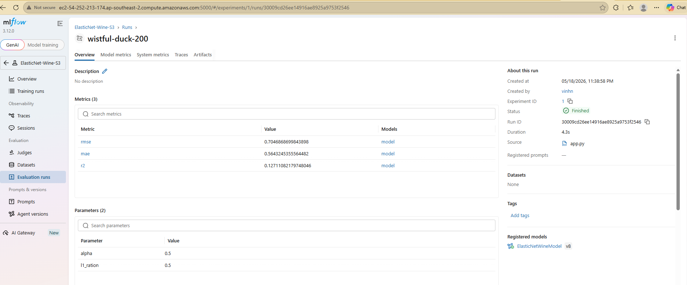
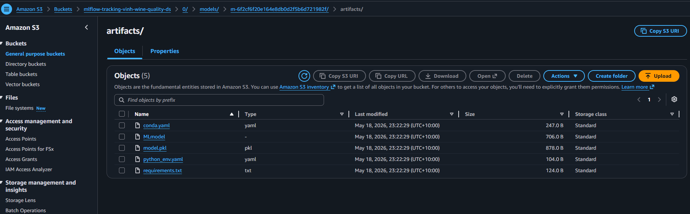

# MLflow Tracking Server on AWS

This project demonstrates how to set up an MLflow Tracking Server on AWS using:

- EC2 as the MLflow server
- S3 as the artifact store
- SQLite as the backend metadata store
- Local machine as the MLflow client

The setup allows local training scripts to log parameters, metrics, models, and artifacts to a remote MLflow server hosted on AWS.

---

## Architecture

```text
Local Machine
    |
    |  logs params, metrics, models
    v
EC2 MLflow Tracking Server
    |
    |  stores metadata
    v
SQLite Database on EC2

EC2 MLflow Tracking Server
    |
    |  stores artifacts
    v
AWS S3 Bucket
```
---

## Screenshots

Create an `images/` folder in your repository and add your screenshots there.

### MLflow Experiments Page



### MLflow Run Details Page



---

## MLflow on AWS Setup:

1. Login to AWS console.
2. Create IAM user with AdministratorAccess
3. Export the credentials in your AWS CLI by running "aws configure"
4. Create a s3 bucket
5. Create EC2 machine (Ubuntu) & add Security groups 5000 port

### Run the following command on EC2 terminal
```bash
sudo apt update
sudo apt install python3-pip python3-venv -y
python3 -m venv mlflow-env
source mlflow-env/bin/activate
pip install mlflow boto3 awscli
```

### Then set aws credentials on EC2 terminal
```bash
aws configure
ssh -i ./mlflow-tracking.pem ubuntu@[your_ec2_public_IP]
```

### Finally
```bash
/home/ubuntu/mlflow-env/bin/mlflow server \
  --host 0.0.0.0 \
  --port 5000 \
  --backend-store-uri sqlite:////home/ubuntu/mlflow.db \
  --default-artifact-root s3://[your_s3_name] \
  --serve-artifacts \
  --workers 2 \
  --allowed-hosts "*" \
  --cors-allowed-origins "*"
```

